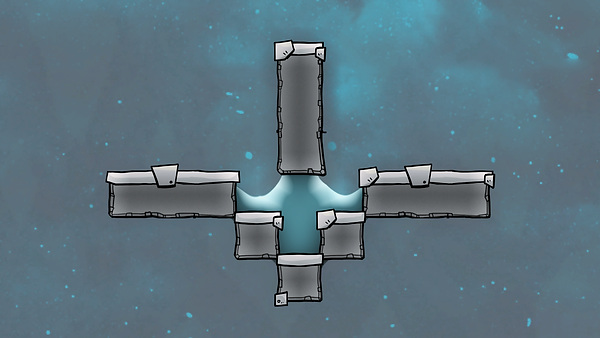

# Liquid lock

## Description

There are many ways to design a liquid lock. This is a common, simple one that is quite reistant to bugginess.

!!! tip
    
    You can stop temperature transfer by putting two liquid locks next to one another and then sucking out the air to create a vacuum between them.

!!! example

    For more on liquid locks, see [Liquid lock basics]().

## Visualization
​

