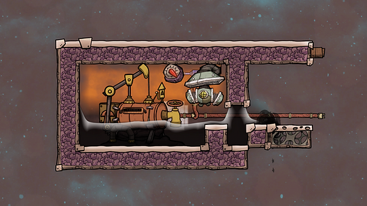

# Oil Well with liquid lock

## Description

This design uses the oil produced by the oil to well maintain a liquid lock. The excess oil pours out to whatever storage  (or other) solution you implement. (You can add a liquid lock on the right if needed.)

The oil (and natural gas) surrounding the oil well helps keep it cool, and minimizes the risk of water flashing to steam during the venting process.

!!! abstract "Construction"

    **Atmo sensor**: above 20 000

## Visualization

## Credit

**Design by**: Francis John

**Source**: "[Oil Well : Tutorial nuggets : Oxygen not included](https://youtu.be/a3UUx3hdg-Y?list=PLS-hAL3jgjOt7qpH-JZ1d5hJcjfoAZOnk&t=266)" on YouTube
